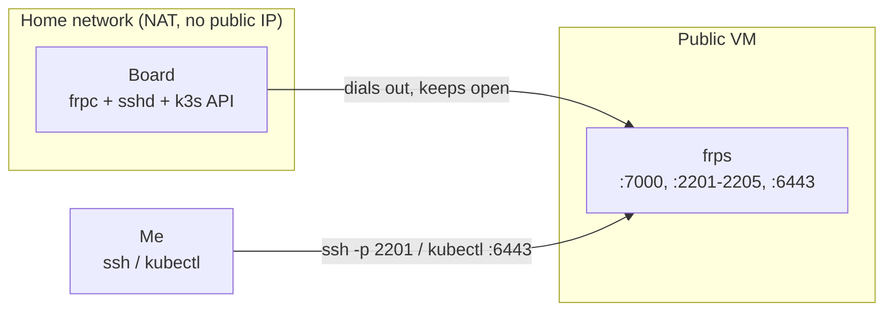

---
tags:
  - frp
  - networking
  - home-lab
  - kubernetes
  - ssh
---

# Remote access with frp reverse tunnels

The cluster sits on a home network: behind a router, on WiFi, NAT, no public IP, no port forwarding. I still want to SSH to every board and run `kubectl` against the API from anywhere, without opening the router. frp reverse tunnels do exactly that. Each board dials **out** to a public relay, and the relay exposes a port that routes back in, so the home network never has to accept an inbound connection.

## How it works

A cheap public VM (anything with a routable IP) runs the frp server, `frps`. Each board runs the frp client, `frpc`, which dials out to that VM and keeps the connection open. Because the board opens the connection, there is no inbound path into the home network to secure.

The relay does not have to be dedicated. Mine shares a box with other services, so `frps` runs as its own sandboxed systemd user, and an `allowPorts` allowlist caps what any client is allowed to request:

```toml
# frps.toml
bindPort = 7000
auth.method = "token"
auth.token = "<frp-token>"
transport.tls.force = true

allowPorts = [
  { start = 2201, end = 2205 },
  { single = 6443 },
]
```



## SSH: one tunnel per board

Each `frpc` maps the board's local `22` to a dedicated remote port on the relay. I reach a board as `ssh -p <port> <user>@<relay>`, aliased to `rpi-N` in `~/.ssh/config`.

| Board | LAN IP | SSH remote port |
|---|---|---|
| rpi-1 | 192.168.1.10 | 2201 |
| rpi-2 | 192.168.1.11 | 2202 |
| rpi-3 | 192.168.1.12 | 2203 |
| rpi-4 | 192.168.1.13 | 2204 |
| rpi-5 | 192.168.1.14 | 2205 |

```toml
# frpc.toml on rpi-1
serverAddr = "relay.example.com"
serverPort = 7000
auth.method = "token"
auth.token = "<frp-token>"

[[proxies]]
name = "rpi-1-ssh"
type = "tcp"
localIP = "127.0.0.1"
localPort = 22
remotePort = 2201
transport.useEncryption = true
transport.useCompression = true
```

## Kubernetes API: one extra tunnel on the control plane

The control-plane board runs one more proxy, `127.0.0.1:6443` to the relay's `:6443`. Combined with the split-horizon DNS from the [cluster setup](01-k3s-cluster-setup.md) (the name resolves to the LAN IP on-network and to the relay off-network), `k8s.lab.example.com` points at the relay when I am away, so remote `kubectl` works with real TLS. The API-server certificate already carries that name in its SAN, so nothing has to be skipped or overridden. If you need a scoped credential rather than the admin kubeconfig, see [a kubeconfig from a ServiceAccount](../engineering-notes/kubeconfig-from-service-account.md).

## Three layers of auth

Nothing rides on the tunnel alone:

- **frp:** token auth plus forced TLS on the control channel.
- **SSH:** public-key only, root login disabled, `AllowUsers` restricted to one account.
- **API:** mutual TLS, the client certificate living in the kubeconfig.

On the relay, open the firewall only for the frp port (`7000`), the SSH port range, and `6443`. Nothing else needs to answer.

## Trade-offs

- **The relay is a single point of failure.** If the VM or `frps` is down, all remote access is down. A separate break-glass path ([Tailscale](07-backup-access-with-tailscale.md)) covers that case.
- **The API port answers to the public internet.** mTLS gates every request and the admin credential never leaves my laptop, but `6443` is reachable from the world. Scope it to known source IPs in the relay's firewall where you can.
- **The frp token is a shared secret** across the server config and every client config. Rotating it means editing all of them and restarting.
- **On-LAN access hairpins.** From the home WiFi, the public name still routes out to the relay and back instead of straight to the LAN IP. A local `/etc/hosts` entry on my laptop avoids the round trip when it matters.

## Sources

- frp: [fatedier/frp](https://github.com/fatedier/frp).
