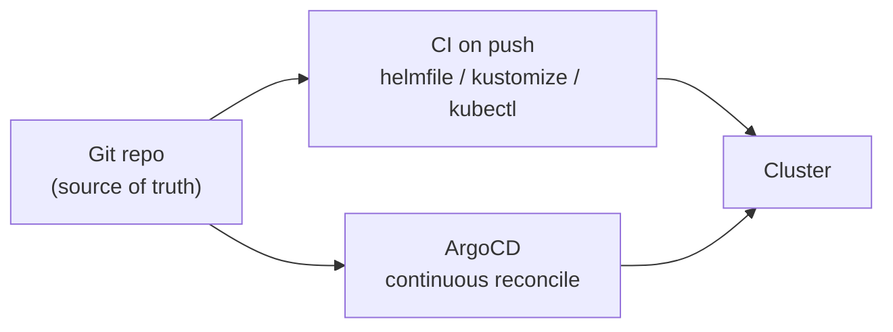

---
tags:
  - gitops
  - argocd
  - kubernetes
  - home-lab
  - helm
---

# GitOps for the cluster with ArgoCD

Everything on the cluster lives in one Git repo and is never applied by hand: config, platform components, apps, secrets. **The repo is the source of truth, not a laptop.** Four layers each own a slice of the desired state, and they deploy in a fixed order.

## The four layers

1. **Helm, through helmfile.** A `helmfile.yaml` declares the platform releases (ArgoCD, Sealed Secrets, cert-manager, external-dns, the frp tunnel operator, a metrics stack), each pinned to a chart version with its own values file. `helmfile sync` installs them.
2. **Kustomize.** The cluster-scoped and namespace-scoped resources render with `kustomize build` and apply with `kubectl`.
3. **Manifests, app-of-apps.** A set of ArgoCD `Application` objects, each pointing at a directory ArgoCD walks with `directory.recurse: true`.
4. **The ArgoCD tree.** The custom resources ArgoCD then syncs continuously from git (`targetRevision: HEAD`): SealedSecrets, DNS records, frp clients, Istio config.

Secrets are **Sealed Secrets**: plaintext never enters git, and the in-cluster controller decrypts against its own key. **cert-manager** issues TLS over a Let's Encrypt DNS-01 challenge.



## Order matters

This is **not** one `helm install`. The layers go in sequence: kustomize namespaces, then the helm platform, then the app-of-apps manifests, then ArgoCD reconciles everything under its own tree. ArgoCD owns only that tree; the platform charts and namespaces are CI territory. CI runs the first three layers on every push to the main branch:

```bash
kustomize build --load-restrictor LoadRestrictionsNone kustomize/ | kubectl apply -f -
helmfile sync
kubectl apply -f manifests/
```

After that bootstrap, a fresh cluster is those three runs plus ArgoCD catching up on the rest.

## Trade-offs

- **The Sealed Secrets key is cluster-bound.** A rebuilt cluster generates a new key, so every SealedSecret has to be re-sealed against it. Lose the key and everything is re-sealed by hand.
- **Helm 4 does not install CRDs on upgrade.** ArgoCD's `crds.install` has to be `true`, and ordering bites: the app-of-apps `Application` objects fail with `no matches for kind "Application"` until ArgoCD's own CRDs exist.
- **Four layers, four failure points.** An upstream chart repo moving, or a flag renamed between tool versions, breaks CI until it is patched.
- **It assumes a single control plane.** One in-cluster ArgoCD and a SQLite datastore ([cluster setup](01-k3s-cluster-setup.md)) both rule out HA for now.

## Sources

- [ArgoCD](https://argo-cd.readthedocs.io/), [helmfile](https://github.com/helmfile/helmfile), [Kustomize](https://kustomize.io/).
- [Sealed Secrets](https://github.com/bitnami-labs/sealed-secrets), [cert-manager](https://cert-manager.io/docs/).
