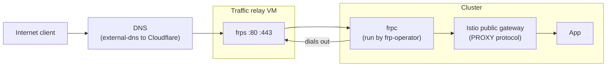

---
tags:
  - frp
  - istio
  - networking
  - home-lab
  - kubernetes
---

# Exposing web services with frp-operator

The admin paths, SSH and the Kubernetes API, ride hand-written frp tunnels ([remote access with frp](02-remote-access-with-frp.md)). Public app traffic to the Istio ingress gateway is a different problem: **it needs ports `80` and `443` owned outright**, and it is managed GitOps-style by `frp-operator`, not a hand-edited config.

## A second, dedicated relay

A separate public VM runs its own `frps` with `allowPorts` of just `80` and `443`, fronting the gateway. It is a second relay on purpose: the API and SSH relay shares `80`/`443` with other services on that box, so it cannot hand those ports to the cluster. The traffic relay owns them.

`frp-operator` reads `Client` and `Upstream` custom resources from git and runs the `frpc` for me, so the tunnel is declarative like everything else:

```yaml
# Upstream (abridged): map the relay's 443 to the gateway Service
spec:
  type: tcp
  remotePort: 443
  localService: istio-public-gateway
  localPort: 443
  proxyProtocol: v2
```



## Keeping the real client IP

The upstreams send `proxyProtocol: v2`, and the gateway parses it natively (`gatewayTopology.proxyProtocol: {}` with `numTrustedProxies: 1` on the gateway's ProxyConfig). **That carries the real client IP through the L4 tunnel into Istio**, so the source address survives and I can whitelist by `AuthorizationPolicy` instead of seeing only the tunnel's address.

## Declarative DNS

external-dns turns `DNSEndpoint` custom resources in git into Cloudflare records: app names point at the traffic relay, `api` and the boards point at the admin relay. The Cloudflare token is a Sealed Secret; the records are plain `A`, left unproxied so the TCP tunnel is end to end.

## Trade-offs

- **PROXY protocol is all-or-nothing per listener.** Every connection to the gateway's TCP listeners must carry a PROXY header. That is safe only because `frpc` is the sole thing talking to the gateway. Add a non-PROXY upstream to the same gateway later and that connection is rejected.
- **QUIC / HTTP3 is dropped, on purpose.** No L4 standard carries the client IP through a UDP tunnel into Istio's QUIC listener, so end-to-end QUIC and airtight IP whitelisting are mutually exclusive here. I chose whitelisting. Getting both back needs an L7 edge terminating HTTP/3 and injecting `X-Forwarded-For`, not an L4 tunnel.
- **Each relay is a single point of failure**, and the frp token is shared across relay and clients. Direct LAN SSH is the fallback when a relay is down.

## Sources

- [frp](https://github.com/fatedier/frp), [frp-operator](https://github.com/zufardhiyaulhaq/frp-operator).
- Istio: [gateway topology and PROXY protocol](https://istio.io/latest/docs/ops/configuration/traffic-management/network-topologies/), [external-dns](https://github.com/kubernetes-sigs/external-dns).
