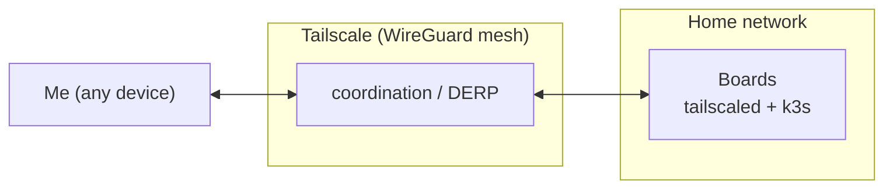

---
tags:
  - tailscale
  - networking
  - home-lab
  - kubernetes
  - ssh
---

# A backup access path with Tailscale

**Every way into the cluster goes through one path: frp.** The boards sit behind residential NAT with no inbound reachability ([cluster setup](01-k3s-cluster-setup.md)), so each one dials out to a relay for SSH and the Kubernetes API ([remote access with frp](02-remote-access-with-frp.md)) and for web ingress ([exposing web services](05-exposing-web-services-with-frp.md)). Nothing can dial in.

That makes frp a single point of failure for reaching the cluster at all. If `frps` crashes, a relay reboots, or the frp config breaks while I am off the home LAN, there is no path to the boards. The relay VM's own `sshd` still answers, but it does not bridge into the home network. A WiFi transmit-path wedge the week before showed how little slack a single-path design leaves.

## The decision

Install **Tailscale** (a WireGuard mesh VPN) on all five boards as a backup, break-glass path, independent of frp. **frp stays primary and the only web-ingress path; Tailscale is backup-only.**

Tailscale gives each board a stable tailnet IP (`100.x`) reachable peer-to-peer or through Tailscale's DERP relays, and it is built for NAT and CGNAT traversal. If frp is down, I install the client on any device and reach the boards directly, without the relay VMs.

1. **Install over the existing frp tunnel.** Run the official install script on each board, bootstrapped through the frp SSH path that already works.
2. **`tailscale up --ssh --accept-dns=false`.** `--ssh` turns on Tailscale SSH: key-less, ACL-governed access to my own devices. `--accept-dns=false` is deliberate: it stops MagicDNS from rewriting the boards' `resolv.conf`, which would break CoreDNS and the manual `/etc/hosts` pin the cluster depends on. Node DNS here is [already fragile](06-node-dns-and-coredns.md); the backup path must not touch it.
3. **Stable tailnet IPs**, one per board:

| Board | Role | Tailnet IP |
|---|---|---|
| rpi-1 | control plane | 100.64.0.1 |
| rpi-2 | worker | 100.64.0.2 |
| rpi-3 | worker | 100.64.0.3 |
| rpi-4 | worker | 100.64.0.4 |
| rpi-5 | worker | 100.64.0.5 |

4. **Access when frp is down.** SSH via `ssh <user>@rpi-1` (MagicDNS) or the `100.x` IP. `kubectl` via SSH to the control plane, then `sudo k3s kubectl`. A direct `https://<tailnet-ip>:6443` kubeconfig is not available until the tailnet IP is added to the API server's `--tls-san` list (the open follow-up below).

This is **access only.** Tailscale carries no public web ingress; the app domains stay on the frp traffic relay. Day-to-day access also stays on frp. Tailscale is the path I reach for only when frp will not answer.

## Alternatives I passed on

| Option | Why not |
|---|---|
| Cloudflare Tunnel | A valid independent tunnel too, but more setup than Tailscale for pure node access. Kept in reserve. |
| Self-hosted WireGuard hub | Reinvents what Tailscale gives free: coordination, NAT traversal, key rotation. |
| Router port-forward plus DDNS | Not viable. The lack of a routable inbound path (likely CGNAT) is the reason frp exists in the first place. |

## Trade-offs

- **It does not survive a dead node NIC.** Tailscale rides the same network interface frp does, so the WiFi wedge that motivated it is exactly the case an overlay cannot fix. This closes the *relay* failure mode, not the *node-link* one.
- **One more agent per board.** `tailscaled` now runs on all five boards and has to be kept current.
- **A new dependency for the backup path.** Reaching the boards this way depends on Tailscale's coordination service being up. That is a different dependency from frp, which is the point, but it is not zero-dependency.
- **No web-ingress coverage.** Public traffic is still frp-only; a traffic-relay outage is not helped by this at all.

The open follow-up: add the control plane's tailnet IP as a `--tls-san` on the k3s server, so a `https://<tailnet-ip>:6443` kubeconfig works directly and `kubectl` becomes a first-class backup path instead of SSH-then-`k3s kubectl`.

## Sources

- Tailscale: [install](https://tailscale.com/download), [Tailscale SSH](https://tailscale.com/kb/1193/tailscale-ssh).
